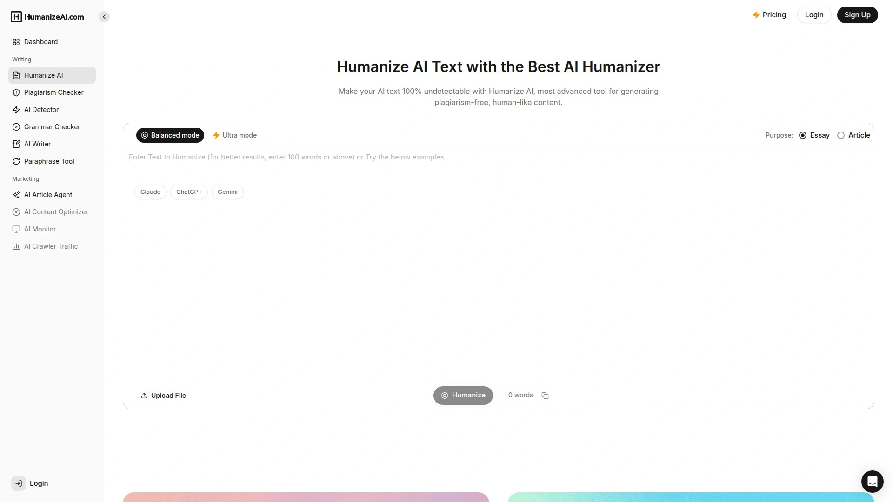

# Latest AI Text Humanizer Collection (Including Detector Bypass Analysis)

Content creators face a daily dilemma—AI tools speed up writing, but detection software flags the results. Whether you're a student submitting essays, a marketer publishing blog posts, or a freelancer delivering client work, AI-generated text that reads too robotic gets rejected or downgraded. The challenge isn't using AI; it's making AI-assisted content sound authentically human.

AI humanizer tools solve this by transforming robotic patterns into natural, conversational writing. These platforms adjust sentence structure, vary rhythm, and remove telltale AI markers while preserving your original message. From free options handling short paragraphs to premium services processing entire ebooks, the right humanizer helps you work faster without compromising quality or triggering detection systems.

---

## **[AISEO](https://aiseo.ai)**

Free unlimited humanization with 25+ language support and advanced tone customization for diverse content needs.

AISEO positions itself as the most accessible AI humanizer available, offering completely free unlimited word processing without hidden limits or paywalls. You can paste or upload AI-generated content and receive naturally flowing human-like text in 10-15 seconds, making it practical for high-volume content creation.

The platform supports transformation across virtually any content type—blog posts, product descriptions, emails, academic papers, social media captions, ebooks, and whitepapers. AISEO maintains consistency across long-form content while adapting each section to feel genuinely human-written. What sets it apart is the 25+ language support, allowing content creators working in Spanish, French, German, Japanese, and other languages to humanize text while maintaining cultural nuances and local phrasing patterns.

The AI Humanizer uses sophisticated algorithms to identify and eliminate unnatural phrasing, stiff tone, and repetitive structures common in AI writing. It preserves your original message and intent while completely restructuring how that message is expressed. The tool retains basic formatting including bold text, italics, and bullet points, so your structured content transfers cleanly to publishing platforms without additional formatting work.

AISEO handles punctuation intelligently, avoiding the obvious errors that frequently expose AI content to detection systems. The Improve Writing mode goes beyond basic humanization, reorganizing sentences for better readability, adjusting tone to match target audiences, and refining overall style to mirror natural human writing patterns. Each output is unique and tailored to your specific input—no two humanizations produce identical results even with similar source material.

For content creators concerned about data security, AISEO follows strict protocols to keep uploaded files confidential. The platform works with text from any AI writing tool, whether you used ChatGPT, Jasper, Copy.ai, or others. For bloggers producing multiple articles weekly, marketers managing content calendars, or students working on assignments, AISEO eliminates the bottleneck of manual rewriting while maintaining authentic voice.

---

## **[Undetectable AI](https://undetectable.ai)**

Premium humanization with built-in detection testing across eight major AI detectors and readability customization.

Undetectable AI earned its reputation through a singular focus—making AI content genuinely undetectable. The platform combines sophisticated humanization with comprehensive detection testing, showing exactly how your content performs against GPTZero, Turnitin, Originality AI, and five other major detectors before you publish.

The humanizer restructures sentences to mirror natural human writing styles without introducing awkward typos or forced errors. Unlike tools that simply insert mistakes to fool detectors, Undetectable AI maintains professional quality while achieving human-like flow. You can adjust readability levels for high school, university, journalist, or marketing purposes, ensuring content matches its intended audience.

What makes Undetectable AI valuable is the purpose customization—specify whether you're creating essays, stories, marketing materials, or other content types, and the AI adapts its humanization approach accordingly. The platform's guarantee is bold: if humanized content still gets flagged by detectors, they refund you without questions. This demonstrates genuine confidence in their technology.

Processing happens quickly, delivering humanized content in seconds even for lengthy documents. The platform supports multiple languages beyond English, making it useful for international content creators. Users consistently report achieving 95-100% human scores on detection tests after processing through Undetectable AI.

The pricing structure offers 250 free words for testing, then requires subscription for continued access. For professional writers, content agencies, and businesses where detection could damage credibility or SEO performance, Undetectable AI provides the reliability needed. The built-in detection preview eliminates anxiety about whether content will pass scrutiny.

---

## **[StealthGPT](https://www.stealthgpt.ai)**

High-speed humanization with extreme stealth mode and comprehensive writing suite including study tools and PDF chat.

StealthGPT goes beyond basic humanization, offering a complete toolkit for content creation and academic work. The AI Humanizer uses four distinct modes—fast, balanced, aggressive, and latest—letting you choose between speed and thoroughness based on your needs. Fast mode works for quick social posts, while aggressive mode handles strict academic detection systems.

The platform evades all major detectors including Turnitin, GPTZero, and Originality AI through advanced pattern replication that mimics authentic human writing. StealthGPT processes content in 100+ languages, making it truly global. The Stealth Writer component functions as your Swiss Army knife—polish essays, craft social posts, or optimize SEO blogs all with natural flow.

What separates StealthGPT from simpler humanizers is the integrated academic suite. The Study Simulator generates quizzes, study guides, and feedback for learning. Chat with PDF allows you to ask questions, summarize, or pull quotes from documents like ChatGPT for your files. The Photo to Answers feature solves homework by snapping worksheet pictures and generating instant solutions.

For students managing heavy workloads, StealthGPT eliminates hours of manual rewriting while maintaining academic integrity through genuinely improved writing. The platform received major updates in 2025, increasing processing speed and expanding format support. Marketing teams appreciate the rapid-fire capabilities for high-volume content production with tone customization adapting copy for different audiences.

The free version limits usage significantly, but paid plans unlock the full capabilities. For users needing authentic content at scale with additional productivity tools, StealthGPT delivers comprehensive value beyond pure humanization.

---

## **[WriteHuman](https://writehuman.ai)**

Natural tone refinement with no-signup free trial and emphasis on subtle humanization over aggressive rewriting.

WriteHuman specializes in light, natural transformations rather than heavy restructuring. The platform adds subtle pacing changes, hesitations, and informal transitions that make AI sentences sound like something real people would write. It supports 10+ languages including English, Spanish, French, German, Chinese, and Japanese while preserving cultural nuances.

The built-in AI detector scans text for AI patterns, letting you identify issues before humanization. If content gets flagged, you can tweak and retry until it passes undetectably. WriteHuman creates content that bypasses Originality AI and Winston AI through careful pattern disruption that maintains professional quality.

What users appreciate about WriteHuman is that it doesn't oversell. The free trial offers 200 words per request with three requests—enough to properly evaluate whether the platform suits your needs. No account required for initial testing, removing friction from the evaluation process. The platform focuses on making text feel genuinely human rather than just evading detectors through tricks.

WriteHuman works best for refining AI-assisted content that's already mostly there but needs that final human polish. Students use it to soften tone in AI-written papers or make summaries feel less robotic. Content creators appreciate how it maintains their voice while removing mechanical patterns. The processing happens in seconds, making it practical for regular use.

The tool received high marks in independent testing, with reviewers noting it successfully passed strict detection while maintaining readability and coherence. For writers who want minimal intervention that preserves their style, WriteHuman provides exactly that focused approach.

---

## **[Humbot](https://humbot.ai)**

Affordable bypass solution with detection preview feature ensuring humanized text passes scrutiny before submission.

Humbot earned recognition for consistently bypassing Turnitin and GPTZero in real student use cases. The platform handles long essays and technical content effectively, maintaining argument clarity while reducing AI fingerprints. Unlike basic spinners that just swap synonyms, Humbot analyzes sentence variety, logic flow, and paragraph structure.

The detection score preview is Humbot's standout feature—you can validate rewritten text looks sufficiently human before submitting anywhere. This preview eliminates the anxiety of wondering whether your humanized content will actually pass detection systems. Students particularly value this confidence before turning in assignments.

Humbot works well for structured documents including academic essays and research summaries. It considers how humans actually construct arguments and present information, rather than just surface-level word changes. The platform preserves technical terminology and specialized vocabulary while humanizing the connecting language and transitions.

Free plan limitations restrict word count significantly, requiring paid subscription for regular use. Pricing remains affordable compared to premium alternatives. Occasional meaning shifts can occur in complex rewrites, so reviewing output remains important. For students needing reliable detection bypass with validation before submission, Humbot provides practical value.

---

## **[Smodin](https://smodin.io)**

All-in-one content platform combining humanization with AI detection, plagiarism checking, and essay writing tools.

Smodin offers a complete writing ecosystem where humanization is just one component. The AI Humanizer converts machine-generated text into natural content by removing distinct patterns, improving readability, tone, and authenticity. It ensures content remains undetectable by major detection systems through advanced pattern disruption.

Beyond humanization, Smodin includes an AI detector for scanning your own work, plagiarism checker for originality verification, essay writer for content generation, and summarizer for condensing information. This all-in-one approach means you handle multiple content needs within a single platform rather than jumping between tools.

The 2025 updates brought improved humanizing technology churning out even more authentic language. The interface received a complete overhaul with slicker, more intuitive design. Most significantly, Smodin doubled down on integrated AI detection avoidance, fooling even the latest 2025 detectors. For a tool offering free access, it delivers impressive capabilities.

Smodin supports content creation, detection bypass, and quality verification in one workflow. Students can draft essays, humanize them, check for AI signatures, verify originality, and refine final versions without switching platforms. The convenience factor makes Smodin appealing despite individual components perhaps not matching specialized standalone tools.

Paid plans from $9-30 monthly unlock advanced features and higher usage limits. For users wanting comprehensive toolkit coverage rather than specialized excellence in one area, Smodin provides practical consolidated value.

---

## **[Bypass GPT](https://bypassgpt.ai)**

Advanced language restructuring using human-like syntax patterns with focus on evasion of pattern detection algorithms.

Bypass GPT employs sophisticated algorithms that restructure language using authentically human syntax patterns, varied vocabulary, and natural phrasing. This approach helps evade the pattern detection algorithms that power AI content checkers. The platform focuses specifically on the technical challenge of bypass rather than broader writing assistance.

The humanizer analyzes text at structural levels, identifying and replacing markers that detection systems look for. Bypass GPT doesn't just paraphrase—it fundamentally rebuilds how ideas are expressed while preserving exact meaning. This deep transformation makes detection extremely difficult even for advanced systems.

For e-commerce businesses, Bypass GPT handles product descriptions at scale, transforming AI-generated copy into authentic-sounding text that connects with customers. Marketing teams use it for maintaining brand voice across high-volume content production. The platform processes multiple content types efficiently, from short social posts to longer articles.

Bypass GPT works best when you need reliable humanization for content that will face scrutiny. The platform focuses on doing one thing exceptionally well rather than offering broad writing features. For professional use cases where detection could damage business outcomes, Bypass GPT's specialized approach delivers consistent results.

---

## **[Quillbot](https://quillbot.com)**

Popular paraphrasing platform with AI humanization capabilities, grammar checking, and broad student adoption.

Quillbot dominates the paraphrasing space with over 4.3 million users globally. While not purpose-built as an AI humanizer, its paraphrasing modes effectively transform AI content into more natural text. The platform offers seven modes including standard, fluency, formal, simple, creative, expand, and shorten—each serving different purposes.

The Synonym Slider provides precise control over how aggressively Quillbot changes your text, letting you balance between heavy transformation and light touch-ups. Integration with Google Docs and Microsoft Word means you can work within your existing writing environment. The grammar checker ensures accuracy across all rewrites, catching issues that might otherwise slip through.

Quillbot includes a summarizer for condensing lengthy texts up to 6,000 words, plagiarism checker via Copyscape integration, and citation generator supporting multiple academic styles. The Co-Writer combines all tools into one collaborative workspace. For students managing multiple aspects of writing projects, Quillbot provides end-to-end support.

The free plan allows paraphrasing up to 125 words at a time with unlimited uses. Premium starts at $19.95 monthly with significant discounts on annual plans. While Quillbot's humanization isn't as sophisticated as dedicated bypass tools, its paraphrasing effectively reduces AI detection for many use cases. Students already familiar with Quillbot can leverage it for light humanization without learning new platforms.

---

## **[Grammarly](https://www.grammarly.com)**

Comprehensive writing assistant with AI detection, tone adjustment, and plagiarism checking trusted by 30+ million users.

Grammarly evolved from grammar checking into a full AI productivity platform. GrammarlyGO provides AI-powered writing assistance including email drafting, tone adjustment, and style checking. While Grammarly's humanization is more basic than specialized tools, it effectively makes content more fluent and natural through sentence rewrites.

What makes Grammarly valuable is its ubiquity—it works across 500,000+ applications and websites through browser extensions and integrations. Over 30 million people and 70,000 teams use it daily, making it the most widely adopted writing tool available. The tone detection feature ensures messages match intent, whether professional, friendly, or urgent.

Grammarly doesn't generate long-form content like dedicated AI writers, but excels at polishing existing writing. The plagiarism checker ensures originality while real-time suggestions enhance clarity and engagement. For teams needing consistent communication quality across email, documents, and web platforms, Grammarly provides reliable oversight.

The premium plan offers significant discounts on annual subscriptions, and a free plan covers basic error-checking. Grammarly works best as a complement to AI content generators rather than a replacement for dedicated humanizers. The platform's strength lies in improving human and AI writing quality rather than specifically bypassing detection, though its rewrites naturally reduce AI fingerprints.

---

## **[Humanize AI Pro](https://www.humanizeai.pro)**

Free platform with proprietary algorithms converting text from major AI sources while preserving SEO value.

Humanize AI Pro offers completely free access without hidden charges or limits, making it accessible for any content creator. The platform's proprietary algorithms skillfully convert text from ChatGPT, Google Bard, Microsoft Bing, QuillBot, Grammarly, Jasper, Copy.ai, and other sources into natural human-like content while preserving original meaning and SEO value.

The output is guaranteed 100% original, bypassing all current AI detection systems through sophisticated transformation. Content creators can generate initial drafts with any AI tool then refine them through Humanize AI Pro to sound genuinely human-written. The platform emphasizes adding authenticity reflecting real incidents and experiences rather than sterile information.

For marketing professionals, the humanizer enhances messages to resonate emotionally with audiences, making campaigns more impactful. Business executives improve emails with appropriate human touch for effective communication. Students benefit from assignments that feel personally written rather than machine-generated. HR professionals humanize internal communications, job postings, and presentations.

Search engines favor human-generated content with valuable information, and Humanize AI Pro ensures compliance with these guidelines. The tool fosters credibility and trust among readers by adding layers of authenticity. For anyone with a story to tell, whether for business or personal reasons, Humanize AI Pro provides versatile transformation that conveys messages effectively.

---

## **[Humanize AI Tool](https://www.humanizeai.io)**

Advanced humanization with keyword freezer, synonym rephrasing, and aggressive modes for zero percent AI detection scores.

Humanize AI Tool offers sophisticated multi-level humanization designed to achieve genuine zero percent AI detection across all major detectors. The platform provides three modes—fast for standard content, aggressive for advanced detectors, and enhanced for strictest detection systems. Each mode applies progressively stronger transformation.

The Keywords Freezer feature lets you lock specific terms and phrases that must remain unchanged, ensuring technical terminology, brand names, or key concepts survive humanization intact. Premium users access synonyms and advanced rephrasing options for even more natural variation. The platform retains formatting including bold, italics, and lists throughout transformation.

Humanize AI Tool combines 15+ smart AI tools under one roof including the humanizer, paraphraser, summarizer, translator, and email writer. This consolidation provides comprehensive writing support beyond pure humanization. The advanced algorithms ensure appropriate vocabulary, avoid punctuation and grammar mistakes, and maintain professional tone throughout.

Free users can humanize limited content for testing, while paid subscriptions unlock full capabilities. The platform guarantees content passes undetected through ZeroGPT, GPTZero, Copyleaks, QuillBot, Turnitin, Sapling, Crossplag, Winston AI, and Originality AI. For content creators requiring absolute confidence their humanized text will pass any detection, Humanize AI Tool's enhanced mode provides maximum transformation.

---

## **[HumanizeAI.com](https://humanizeai.com)**

Complete AI writing suite with SEO, AEO, and GEO optimization for visibility across search engines and AI platforms.

HumanizeAI.com positions itself as the best AI humanizer for 2025 by delivering more than basic text transformation. The platform combines humanization with advanced SEO (search engine optimization), AEO (answer engine optimization), and GEO (generative engine optimization) to help content perform across Google, Bing Copilot, Perplexity, ChatGPT, and emerging AI platforms.

Unlike free tools like Quillbot and Grammarly that only lightly reword, HumanizeAI.com provides genuinely plagiarism-free, undetectable content optimized for modern search and AI discovery. The platform helps brands win visibility in Google AI Overviews and other generative AI results, addressing the fundamental shift in how people discover content.

The humanizer makes AI-generated text sound natural while also supporting multilingual writers so non-native voices aren't penalized by overly perfect English triggering suspicion. Long-form content receives full optimization for SEO while maintaining human readability and engagement. The platform addresses false positives where genuine human writing gets wrongly flagged.

HumanizeAI.com includes plagiarism checks, grammar correction, and complete writing assistance beyond humanization alone. For businesses building content strategies around AI discovery rather than just traditional SEO, the GEO capabilities provide competitive advantage. The comprehensive approach makes HumanizeAI.com suitable for serious content operations rather than casual use.

---

## **[GrubbyAI](https://grubby.ai)**

Fastest and most affordable bypass tool guaranteeing 99%+ human scores with one-click transformation.

GrubbyAI markets itself as the fastest, most affordable, and least detectable AI humanizer available, guaranteeing performance superior to any competitor. The platform achieves 99%+ human scores on even the most advanced detectors including GPTZero, Turnitin, Content at Scale, and others through cutting-edge algorithms.

ChatGPT embeds watermarks in generated text that detection systems recognize, but GrubbyAI quickly replaces these patterns with natural human-like wording. The anti-AI detector technology specifically targets known markers that flag content as machine-generated. For students, GrubbyAI eliminates the 2-3 hours typically spent manually humanizing text—often unsuccessfully.

The platform prioritizes student safety by ensuring humanized text passes both AI detection and plagiarism checks simultaneously. Advanced technology produces genuinely plagiarism-free content rather than simply disguising copied material. GPTZero testing showed GrubbyAI achieving detection scores indicating human authorship.

The one-click functionality makes GrubbyAI extremely simple—paste content, click the button, receive humanized text within seconds. No complex settings or mode selection required. For users wanting the fastest path from AI text to undetectable content without technical complexity, GrubbyAI delivers straightforward efficiency. The guarantee of outperforming competitors demonstrates confidence in their approach.

---

## **[JustDone AI Humanizer](https://justdone.com)**

Student-focused humanizer preserving personal writing tone with integrated detection checking for self-review.

  

JustDone AI Humanizer earned educator recommendations for helping students sound like themselves while using AI assistance responsibly. The platform adjusts sentence structure, swaps natural transitions, and breaks up the "too perfect" rhythm detectors identify. What distinguishes JustDone is tone preservation—students maintain their authentic voice throughout humanization.

One student wrote a research paper draft, humanized it through JustDone, then tested in Turnitin's AI detection with no flags. More importantly, reading the essay aloud still sounded like the student's actual writing style. This balance between bypass and authenticity separates JustDone from tools that simply mask content under heavy transformation.

The integrated AI detector allows students to self-review before submission, reducing anxiety by showing how work appears from an educator's perspective. This transparency encourages learning rather than hiding, teaching students about AI detection patterns while providing practical solutions. Teachers appreciate this educational approach over pure bypass.

JustDone works well for both low-stakes writing and high-stakes assignments like personal essays where voice matters. The platform emphasizes collaboration with AI responsibly rather than cheating detection systems. For students wanting to sound like themselves while benefiting from AI assistance, JustDone provides ethical middle ground with technical effectiveness.

---

## **[StealthWriter](https://stealthwriter.ai)**

SEO-optimized humanization maintaining content integrity without grammar mistakes or awkward vocabulary.

StealthWriter focuses specifically on converting AI content into natural, SEO-friendly text that maintains search visibility. The platform applies human touch to machine-generated text while ensuring polished, grammatically correct output. Unlike tools inserting intentional errors to fool detectors, StealthWriter maintains professional quality throughout.

The robust built-in AI detector lets users verify humanized content before publishing, providing confidence it will pass scrutiny. StealthWriter offers multiple rewriting modes tested against GPTZero, ZeroGPT, Originality.ai, Copyleaks, Turnitin, Winston AI, and Quillbot. The natural output feels authentic rather than artificially manipulated.

For web developers and designers, StealthWriter ensures website content reads naturally, improving user engagement and overall experience. Bloggers use it to maintain authentic voice while scaling content production. The platform delivers consistently readable results suitable for professional publication without embarrassing detection.

Free plan offers 300 words per request for testing, with paid plans from $20-50 monthly for regular use. StealthWriter works best for content creators prioritizing both detection bypass and SEO performance, recognizing that humanized content must also rank and engage to deliver value. The dual focus makes it practical for commercial content operations.

---

## **[Monica AI](https://monica.im)**

Browser-based AI assistant with humanization capabilities and extensive integration across web platforms.

Monica operates as a comprehensive AI assistant available through browser extensions, bringing AI capabilities wherever you work online. The humanizer transforms AI-generated text into natural content as part of broader productivity features including translation, summarization, and content generation.

Monica's strength lies in convenience—it's accessible from any webpage through the extension, eliminating the need to switch to dedicated platforms. For users who want occasional humanization alongside other AI tasks, Monica's integrated approach saves time. The platform handles basic text transformation effectively for standard content.

However, Monica's humanization isn't as sophisticated as specialized tools, and independent testing showed mixed detection bypass results. For casual use or non-critical content, Monica provides adequate transformation. For content facing strict detection or high-stakes scenarios, dedicated humanizers deliver more reliable results.

Monica works well for users already relying on the platform for other AI tasks who need occasional light humanization. The browser-based access makes it convenient for quick transformations without leaving your workflow. Consider it a general-purpose tool rather than detection bypass specialist.

---

## **FAQ**

**Can humanized AI content still maintain my original writing style and voice?**

Yes, advanced humanizers like AISEO, JustDone, and WriteHuman specifically preserve your unique voice while removing robotic patterns. They adjust sentence structure and phrasing without changing your fundamental tone. Always review humanized output to ensure it still sounds like you—add personal anecdotes, specific examples, or opinions where the tool made content too generic. The best results come from collaboration between AI transformation and human refinement.

**Do these AI humanizers work for academic writing and will they help avoid plagiarism detection?**

Quality humanizers like StealthGPT, Humbot, and Undetectable AI handle academic writing effectively, transforming AI assistance into authentic-sounding essays and papers. However, humanization alone doesn't guarantee plagiarism-free content—always ensure your work represents original ideas and proper citations. Use these tools to refine AI-assisted drafts while maintaining academic integrity. Most platforms include plagiarism checking alongside humanization to verify originality.

**Which AI humanizer provides the best free option for regular content creation?**

AISEO offers the most generous free access with unlimited words and no hidden paywalls, making it ideal for high-volume creators. Humanize AI Pro also provides completely free unlimited use. For occasional needs, Quillbot's free tier works well despite 125-word limits per use. Most other platforms offer limited free trials (200-300 words) before requiring subscription. Choose based on your volume—unlimited free tools for regular use, premium services when detection bypass is absolutely critical.

---

## **Conclusion**

The AI humanizer landscape offers solutions for every need, from free unlimited platforms to premium services with detection guarantees. Whether you're publishing content professionally, submitting academic work, or creating marketing materials, the right humanizer transforms AI assistance into authentically human writing that connects with audiences and passes scrutiny.

[AISEO](https://aiseo.ai) stands out for content creators prioritizing accessibility and volume. The completely free unlimited humanization, support for 25+ languages, and sophisticated tone customization make it practical for anyone producing regular content. When you need AI assistance without robotic patterns, budget constraints, or detection concerns limiting your creativity, AISEO delivers professional-grade humanization that keeps your workflow moving forward.
